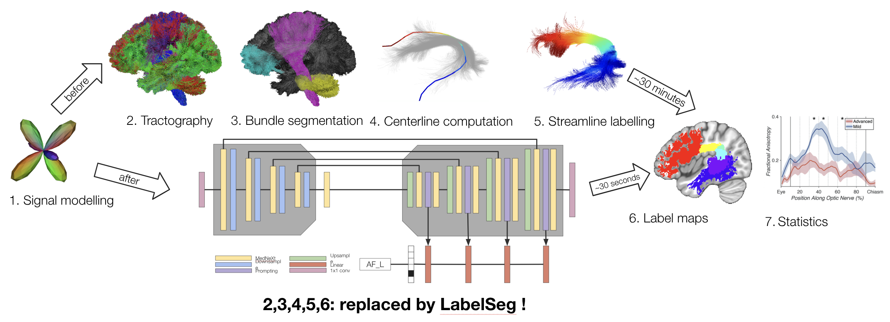

# BundleParc: off-the-shelf bundle parcellation without tractography

(formerly LabelSeg)

Training code for __BundleParc: automatic tract labeling without tractography__

For actually running BundleParc, please the section below.

## Using BundleParc

__BundleParc is available in [scilpy](https://github.com/scilus/scilpy) !__

See `scil_fodf_bundleparc.py -h` or the [scilpy documentation](https://scilpy.readthedocs.io/en/latest/scripts/scil_fodf_bundleparc.html) for more information. BundleParc is also available through scilpy's Docker image [scilus/scilpy:2.2.0_gpu](https://hub.docker.com/r/scilus/scilpy).

__BundleParc-flow can allow you to easily run BundleParc on whole populations.__
See [BundleParc-flow](https://github.com/scil-vital/BundleParc-flow) for more information.

## Installation

This project only supports Python3.10 currently. It is recommended to install the software in a [virtualenv](https://virtualenv.pypa.io/en/latest/).

To install, in the cloned project's folder:

```bash
pip install -e .
```

## Troubleshooting

Ran into a problem during installation ? Have a question ? Please open an issue !

## To cite

```Antoine Théberge, Zineb El Yamani, François Rheault, Maxime Descoteaux, Pierre-Marc Jodoin (2025). LabelSeg. ISMRM Workshop on 40 Years of Diffusion: Past, Present & Future Perspectives, Kyoto, Japan.```

Full paper submitted to Medical Image Analysis.
