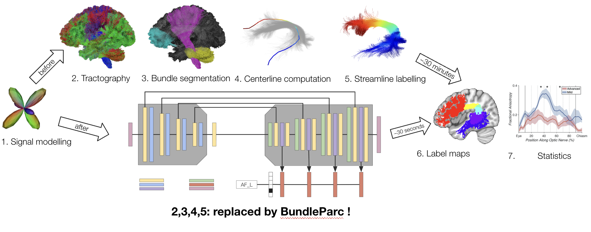

# LabelSeg
Code and pretrained model for __LabelSeg: automatic tract labeling without tractography__

## Applicability

LabelSeg so far has not been tested on data other than healthy young adults. If you're using LabelSeg on pathological/young/old patients, let me know how it went and what can be improved ! Send me an email at "antoine (dot) theberge (at) usherbrooke (dot) ca".

## Installation

Only Python3.10 is currently supported. It is recommended to install the software in a [virtualenv](https://virtualenv.pypa.io/en/latest/).

To install, in the cloned project's folder:

```bash
pip install -e .
```

Docker containers are coming soon-ish.

## Running

The method takes as input a fODF map of order 6 (descoteaux07 basis) and a WM mask:

Example command:
```labelseg_predict fodf.nii.gz wm_mask.nii.gz --out_prefix sub-001__ --nb_pts 25```

See `--help` for more arguments.

Example output:
```sub-001__AF_left.nii.gz, sub-001__AF_right.nii.gz, ..., sub-001__UF_right.nii.gz```

The software will output 71 files, each corresponding to a bundle's label map. The bundle definitions follow TractSeg's, minus the whole CC.

__LabelSeg may move to [scilpy](https://github.com/scilus/scilpy) soon ! Stay updated by starring the repo.__

## Troubleshooting

Ran into a problem during installation or prediction ? Have a question ? Please open an issue !

## To cite

```Antoine Théberge, Zineb El Yamani, François Rheault, Maxime Descoteaux, Pierre-Marc Jodoin (2025). LabelSeg. ISMRM Workshop on 40 Years of Diffusion: Past, Present & Future Perspectives, Kyoto, Japan.```

Full paper in the works.
